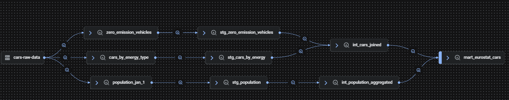

# Eurostat Automated Analytics Pipeline

An end-to-end automated data pipeline that ingests automotive and demographic data from Eurostat, transforms it using dbt and BigQuery, and serves key metrics to a Looker Studio dashboard.

---

## Architecture & Data Flow



1. **Extraction**: A GCP Cloud Function fetches 3 data files from the Eurostat API and uploads them to a GCS bucket (`cars-raw-data/raw/latest/`).
2. **Raw Storage**: External tables are created in the BigQuery `raw` dataset pointing to these files.
3. **Transformation**: GitHub Actions triggers dbt to transform the data through 3 logical layers.
4. **Visualization**: The final mart table in BigQuery feeds the Looker Studio dashboard.

---

##  Data Pipeline Breakdown

### 1. Data Ingestion (GCP Cloud Function & GCS)
- A Python Cloud Function connects to the Eurostat API and downloads 3 datasets (car statistics and demographic data).
- The raw files are uploaded automatically into a Google Cloud Storage (GCS) bucket under the `raw/latest/` path.
- BigQuery reads these raw files inside the `eurostat-cars-raw` dataset.

### 2. dbt Modeling Layers
The transformation in PyCharm/dbt is split into three Medallion architecture layers:

* **Staging (`dbt_staging`)**:
  * Consists of 3 models (one for each raw file).
  * Cleans up column names, casts correct data types, and handles initial filtering.
  * Materialized as **Views**.
  * Contains basic data quality tests (`not_null`, `unique`).

* **Intermediate (`dbt_intermediate`)**:
  * Consists of 2 models:
    1. `int_population_aggregated` – aggregates population statistics by country and year.
    2. `int_cars_joined` – combines two car-related raw sources into a single clean overview.
  * Materialized as **Views**.

* **Marts (`dbt_marts`)**:
  * Consists of 1 final model: `mart_eurostat_cars`.
  * Joins population and car data to calculate key analytics (e.g., cars per 1,000 inhabitants, zero-emission car share).
  * Materialized as a **Table** for optimal query performance.
  * Contains data quality test `not_null`.

---

## Custom Schema Configuration (dbt)

To keep datasets clean and organized in BigQuery, custom schemas are defined in `dbt_project.yml`.

Using the `dbt` prefix from `profiles.yml`, dbt automatically creates three separate target datasets in BigQuery:
- `dbt_staging`
- `dbt_intermediate`
- `dbt_marts`

**Example configuration (`dbt_project.yml`):**
```yaml
models:
  eurostat_cars_dbt:
    staging:
      +schema: staging
      +materialized: view
    intermediate:
      +schema: intermediate
      +materialized: view
    marts:
      +schema: marts
      +materialized: table
```
## Automation & Scheduling (CI/CD)
The pipeline runs completely hands-free without needing manual dbt run or dbt test commands:

#### GitHub Actions:

- A workflow file runs dbt run and dbt test using credentials stored securely in GitHub Secrets.

- It supports repository_dispatch to receive triggers from external tools.

#### Google Cloud Schedulers:

- Scheduler #1 (08:50): Triggers the Cloud Function to fetch raw files from Eurostat.

- Scheduler #2 (09:00): Sends an HTTP POST call to GitHub Actions API to run the dbt pipeline and execute tests.

## Business Intelligence
The final table (dbt_marts.mart_eurostat_cars) is connected directly to Looker Studio to display country-level trends, EV adoption rates, and motorization density across Europe.

---
